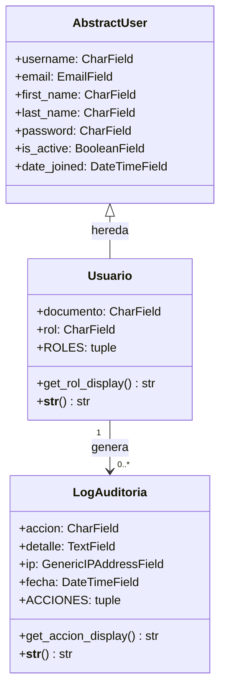
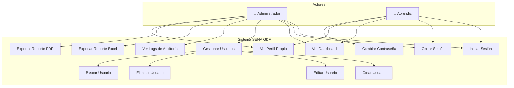
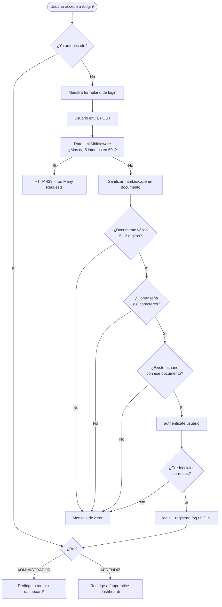
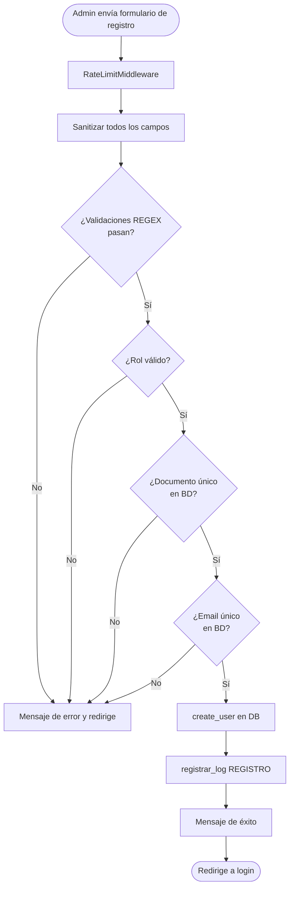
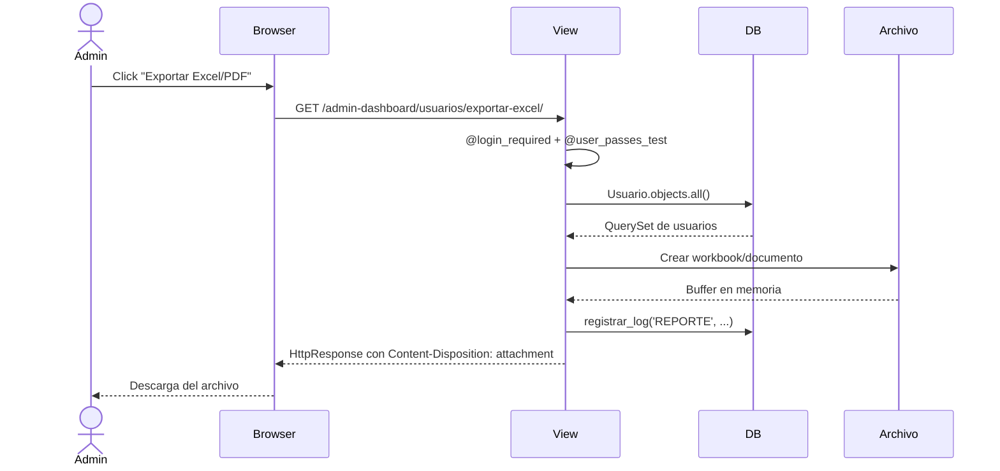
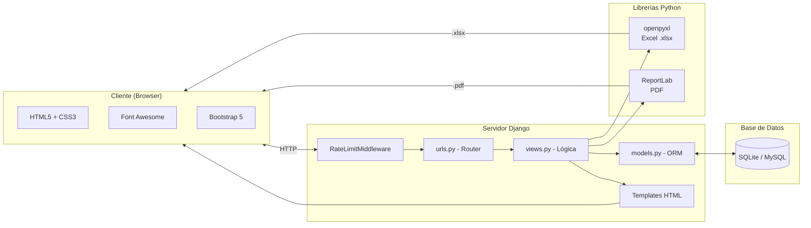
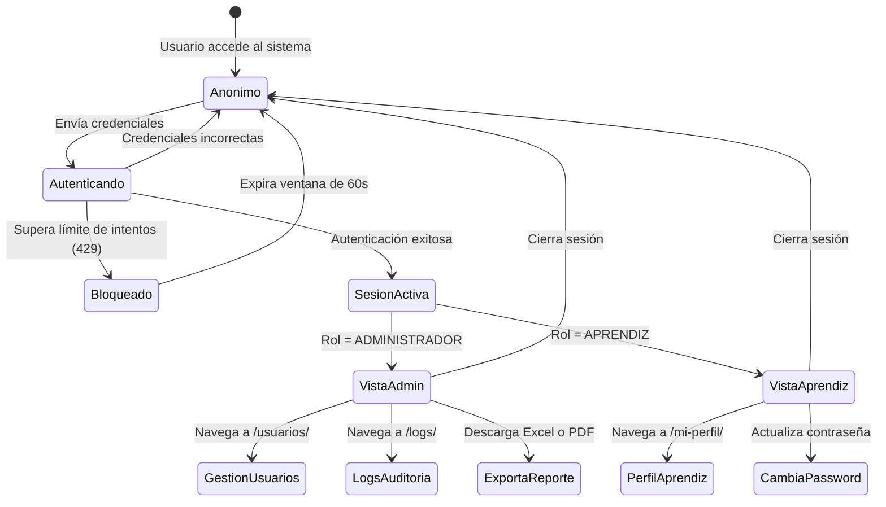

# 📐 Diagramas UML — SENA GDF Sistema de Gestión

Documentación técnica del sistema mediante diagramas UML representados en sintaxis **Mermaid**.

---

## 1. Diagrama de Clases (Modelos)

---

## 2. Diagrama de Casos de Uso

---

## 3. Diagrama de Flujo — Autenticación (Login)

---

## 4. Diagrama de Flujo — Registro de Usuario

---

## 5. Diagrama de Secuencia — Exportación de Reporte

---

## 6. Diagrama de Componentes — Arquitectura del Sistema

---

## 7. Diagrama de Estados — Sesión de Usuario

